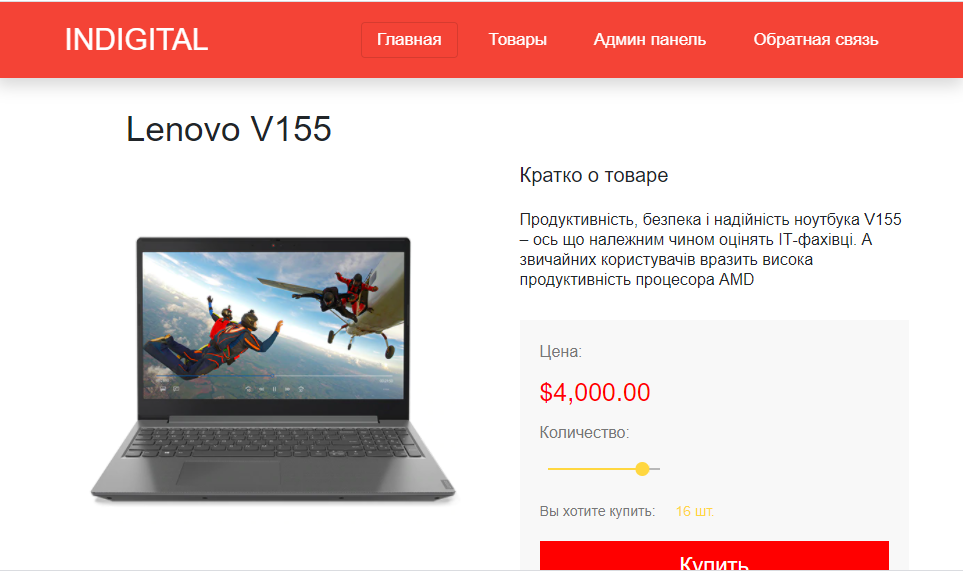

# Shop
 I have decided to develop the app, where one can purchase different good. 

 User has an opportunity to:
  * authenticate
  * buy products
  * view products
  * sort products
  * add comments 
 Also there is the admin panel, which is available only for the super admin. To get full access to it, you should type in terminal command `python manage.py createsuperuser`. After filling in all  neccessary fields, you are going to be granted access. Then open the browser on `http://127.0.0.1:8000/admin/app`

> 

## Folders
* `django`- a django app
* `angular` - an angular app
## How to run 
* `cd django` - on Windows
* `python manage.py makemigrations`
* `python manage.py migrate`
* `python manage.py runserver` 
In the separate terminal 
* `cd shop` - on Windows
* `npm run start` 
Then open the brower on http://localhost:4200/ 
